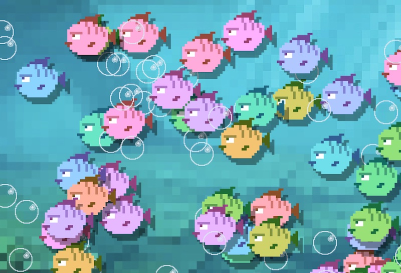

# PixiJS Startproject

Dit is een startproject voor het werken met ***PixiJS en Typescript***. Om met dit project te werken moet je eerst [NodeJS installeren](https://nodejs.org/en/). Je kan dan deze repository downloaden en vervolgens installeren met:

```bash
npm install
```

Daarna kan je aan de slag met ontwikkelen in development mode:

```bash
npm run start
```

Als je de game wil publiceren kan je een `build` uitvoeren:

```bash
npm run build
```
## Voorbeeldcode

Toon het Pixi Canvas en een Sprite:

```javascript
import * as PIXI from 'pixi.js'
import fish from "./images/fish.png"

let app = new PIXI.Application({ width: 800, height: 450 })
document.body.appendChild(app.view)

let sprite = PIXI.Sprite.from(fish)
app.stage.addChild(sprite)
```
## Opdracht

Maak een aquarium met vissen en bubbles zoals in deze afbeelding. 



- Je kan een `for` loop en `Math.random()` gebruiken voor de posities.
- Je kan `sprite.tint = Math.random() * 0xFFFFFF;` gebruiken voor een random kleur.

<br>
<br>
<br>

# Links

- [PixiJS Examples](https://pixijs.io/examples/)
- [PixiJS getting started](https://pixijs.io/guides/basics/getting-started.html)
- [PixiJS install instructions](https://github.com/pixijs/pixijs)
- [NodeJS install](https://nodejs.org/en/)
- [Typescript](https://www.typescriptlang.org)
- [Dit project zelf opzetten from scratch](./scratch.MD)
- [Parcel development tool](https://parceljs.org)